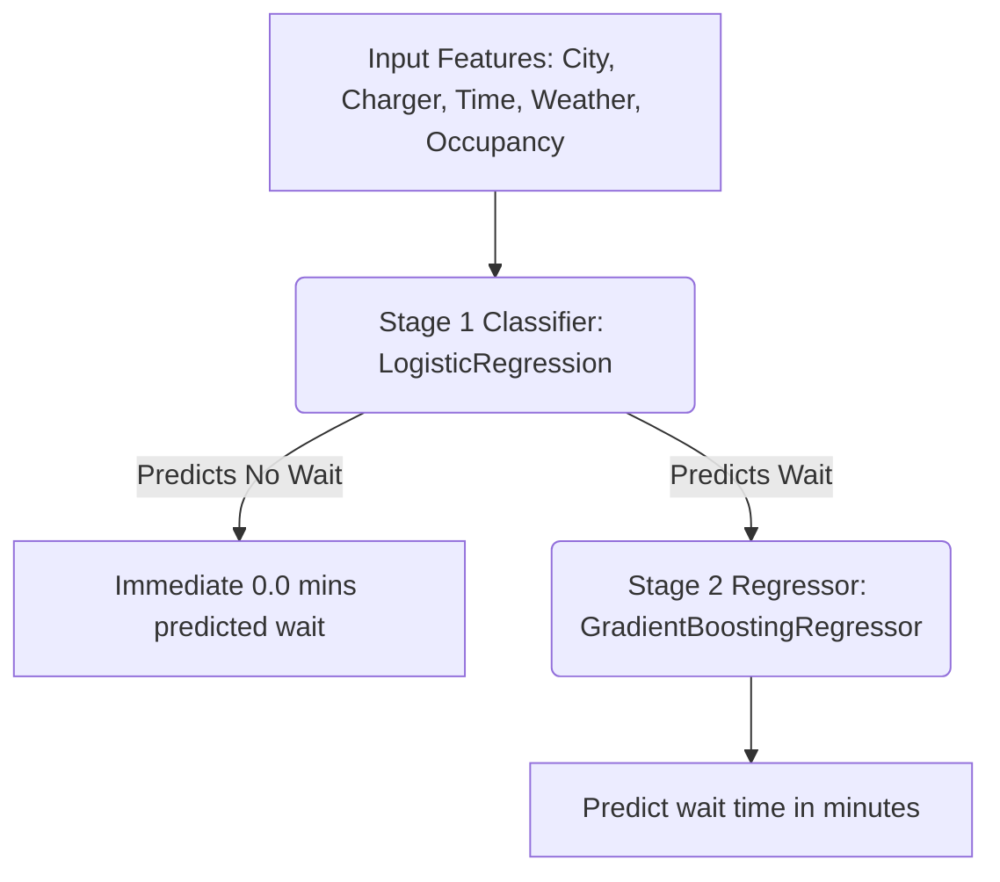

# Smart EV Charging Station Recommendation System

A machine learning-powered web application that predicts waiting times at electric vehicle (EV) charging stations and uses those predictions—alongside charger availability, distance, and pricing—to recommend the optimal charging station to the user.

---

## 🚀 Key Features

*   **Two-Stage Machine Learning Pipeline**: Combines classification (predicting if there is a wait) and regression (predicting the wait duration) to handle zero-inflated wait-time distributions.
*   **Intelligent Ranking & Recommendation**: Stations are scored out of 10 based on predicted wait time, distance, cost per kWh, and port availability.
*   **Dynamic Visual Dashboard**: A modern, premium user interface with a glassmorphism theme, interactive filters (City, Area, Charger Type), and responsive design.
*   **Live Simulation Mode**: Uses current system time to simulate real-time traffic and occupancy patterns for station recommendations.

---

## 🛠️ Technology Stack

*   **Backend**: Python, Flask, Flask-CORS
*   **Machine Learning**: Scikit-Learn (`LogisticRegression`, `GradientBoostingRegressor`), Pandas, NumPy
*   **Frontend**: Vanilla HTML5, CSS3 (Modern Glassmorphic styling), JavaScript (ES6+)

---

## 📂 Project Structure

```text
├── Dataset/
│   ├── EV_Charging_80_20_Balanced.csv    # Preprocessed dataset for station lookups
│   └── ev_charging_station_data.csv       # Raw dataset (Git-ignored)
├── web_app/
│   ├── images/
│   │   └── distance.png                  # UI Icons
│   ├── app.js                            # Frontend application logic
│   ├── city_areas.py                     # Geocoded areas and coordinates
│   ├── flask_app.py                      # Flask REST API server
│   ├── index.html                        # Application landing page
│   ├── recommend.html                    # Recommendation visual results dashboard
│   └── styles.css                        # Glassmorphism visual theme
├── .gitignore                             # Specifies files for Git to ignore (e.g. raw 339MB CSV)
├── clf_model.pkl                          # Stage 1: Binary Classification Model (Wait vs No-Wait)
├── gbr_model.pkl                          # Stage 2: Regression Model (Wait-Time Prediction)
├── model_metadata.pkl                     # Feature column names & categorical encoders
├── requirements.txt                       # Python dependencies
└── README.md                              # Project Documentation
```

---

## 🧠 Machine Learning Architecture

The system implements a **Two-Stage prediction pipeline** to resolve the high abundance of zero-wait records (zero-inflated dataset):



1.  **Stage 1 (Classification)**: Logistic Regression decides whether there will be a wait time (`is_wait` = 0 or 1).
2.  **Stage 2 (Regression)**: If a wait is predicted, a Gradient Boosting Regressor calculates the expected wait duration in minutes.

---

## 💻 Getting Started

### Prerequisites

Ensure you have Python 3.10+ installed on your machine.

### Installation

1.  Clone the repository:
    ```bash
    git clone <your-repository-url>
    cd <repository-folder-name>
    ```

2.  Install the required Python packages:
    ```bash
    pip install -r requirements.txt
    ```

### Running the Application

1.  **Start the Backend Server**:
    Run the Flask server from the project root:
    ```bash
    python web_app/flask_app.py
    ```
    The backend will run on `http://127.0.0.1:5000`.

2.  **Open the Frontend**:
    Open the frontend files using a web browser or run a simple local web server (e.g., Live Server extension in VS Code) on the `web_app` folder. 
    You can start at `web_app/index.html` to access the landing screen.
